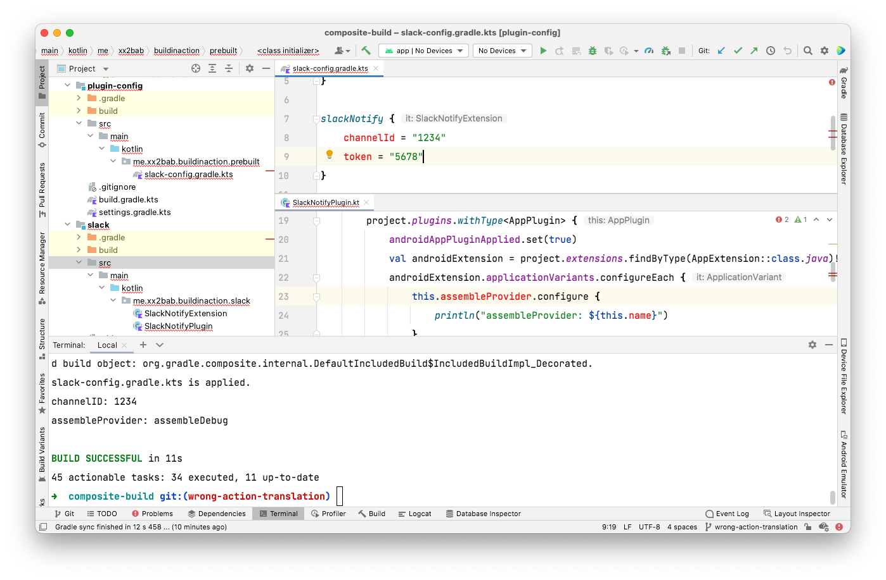
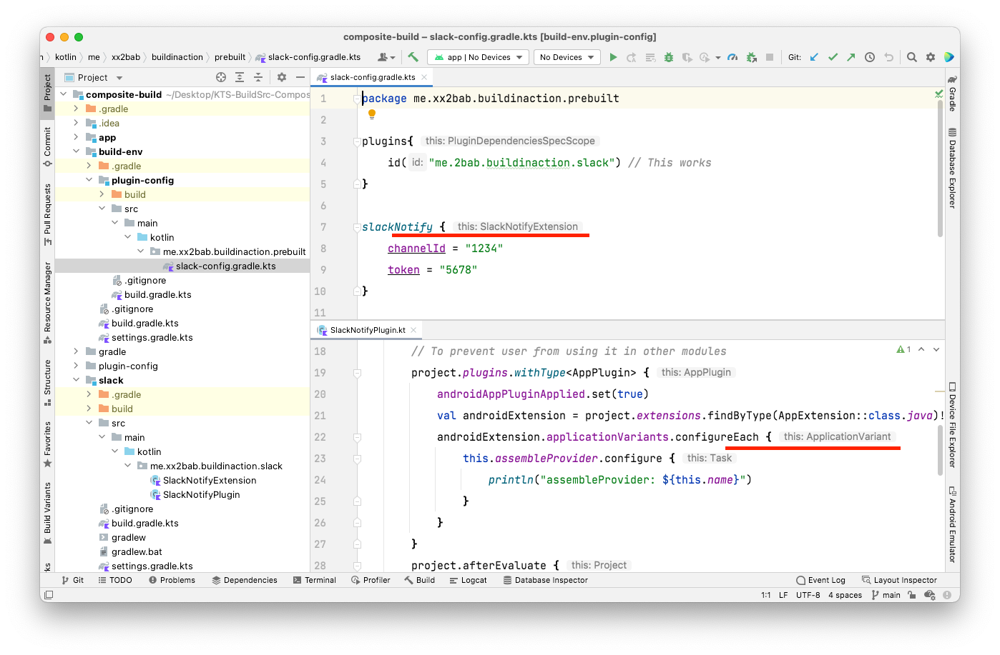

# Composite build case

## Solution

**!!!Use the code snippet below can solve the issue!!!.**

``` kotlin
resolutionStrategy {
    eachPlugin {
        when (requested.id.namespace) {
            "com.android" -> useModule("com.android.tools.build:gradle:4.2.2")
            "org.jetbrains.kotlin" -> useModule("org.jetbrains.kotlin:kotlin-gradle-plugin:1.5.31")
        }
    }
}

// Do not use below approach in settings.gradle.kts, though Gradle is fine with it, and it's short.
// However the IDE does not support it well on some cases. 
// plugins {
//     id("com.android.application") version "4.2.2"
//     kotlin("android") version "1.5.31"
// }
```

However, I don't know what happened to IDE if I used `plugins{}` in `pluginManagement`?

## Original issue



Check out the `main` branch of this repository, you can see I did 2 things to migrate from main:

1. Moved `plugin-config` out of `build-env`, made it a single module instead of multi-module structure but with one module only (simplified the layer)
2. Removed `buildscript` block from root `build.gradle.kts`, use `pluginManagement` and `includeBuild("plugin-config")` instead (migrated to new plugin management dsl).

**The 2nd action caused the `org.gradle.api.Action<T>` translation error, the key thing is I must declare `buildscript { dependencies { classpath("me.2bab.buildinaction:buildEnv:+") } }`.** The `Action<T>` here should equal to [Type-Safe Builders](https://kotlinlang.org/docs/type-safe-builders.html) which infers the block context as `this` instead of `it`. The correct behaviour you can see as below. However this is not a Gradle error, because the build was successful. I guess it's an IDE related issue.

